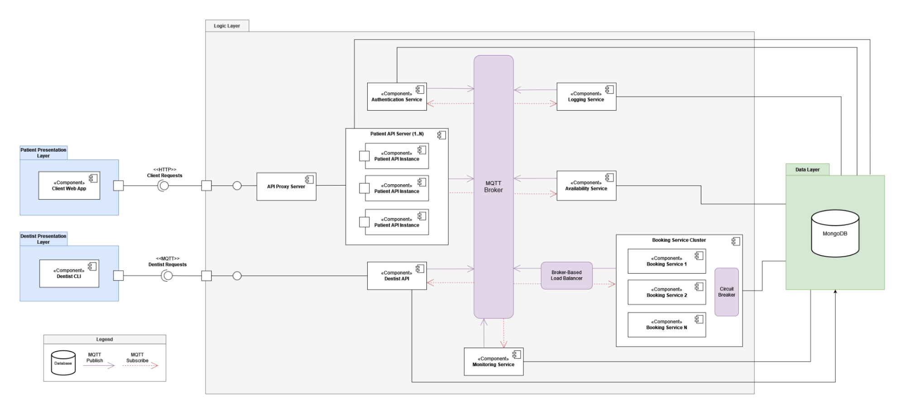
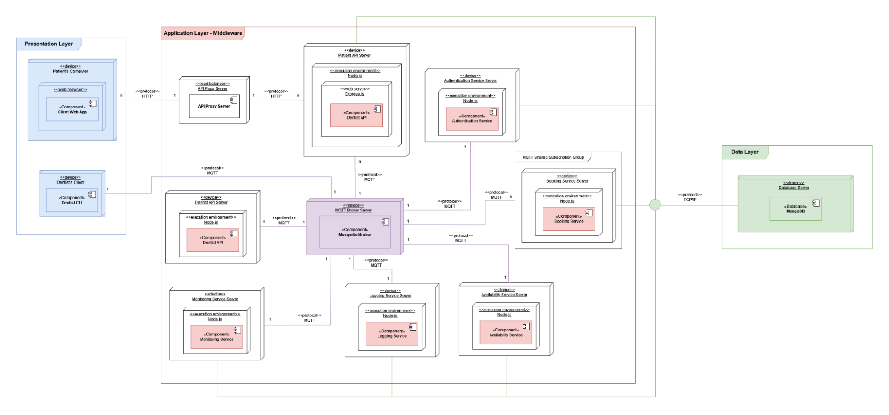
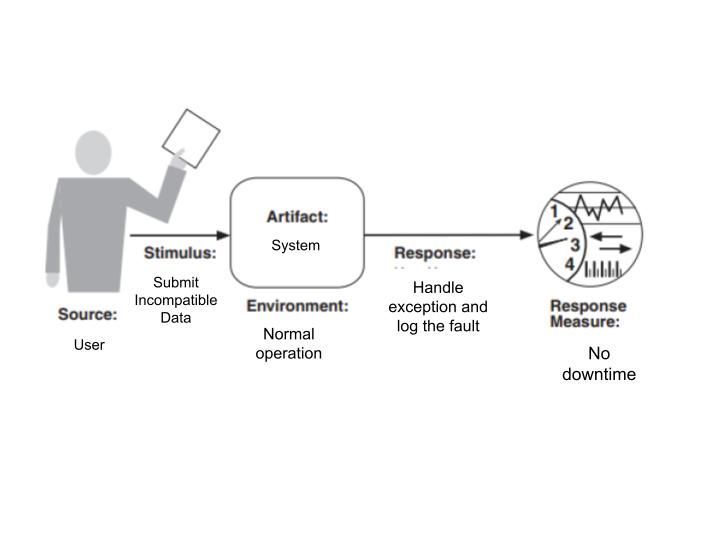
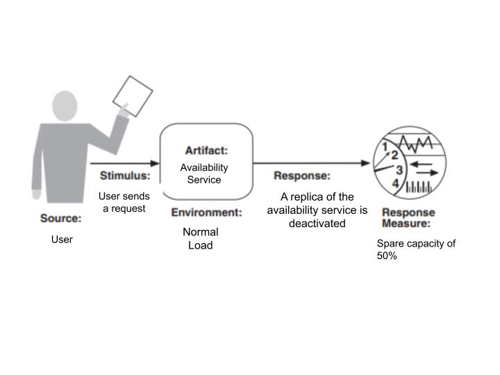
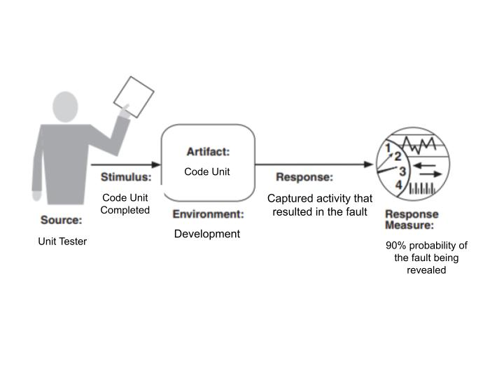

# Dentago

Dentago is a **distributed system** designed to centralize dentist appointment bookings across Sweden. It relies on **MQTT** for inter-component communication to achieve scalability, and reliability. Fault tolerance is achieved through diverse mechanisms such as **circuit breakers** and **load balancers** [\[see diagram below\]](#component-diagram). To users, the system appears seamless: patients interact via a web-based interface, while dentists manage appointments through a dedicated GUI. The system is accessible on both computers and mobile devices, offering a versatile and intuitive user experience.

## Component Diagram

## Deployment Diagram

## Functional Requirements

- FR1: The system shall provide a web-based graphical user interface for patients.
- FR2: The system’s patient user interface shall have a navigable map view of the Gothenburg area.
- FR3: The system’s patient user interface shall allow users to reserve/book a time slot for a dentist appointment.
- FR4: The system’s patient user interface shall allow users to cancel reserved/booked time slots.
- FR5: The system shall have a notification system for users.
  - FR5.1: The system shall notify the patient on the website when suitable slots become available.
  - FR5.2: The system shall notify the user about the state of their reservation (confirmed, rejected, or canceled).
- FR6: The system shall react to simultaneous bookings by making changes in availability visible in the patient interface.
- FR7: The system shall be usable in a range of different devices such as smartphones, laptops, and tablets.
- FR8: The system shall allow dentists to manage their appointments such as seeing appointments and canceling appointments.
- FR9: The system shall allow the creation/registration of clinics and dentists in the database.

## User Stories

- US1: As a patient, I want to have a graphical user interface, so that I can interact with the system in an intuitive way. \[FR1\]
  - Acceptance Criteria
    - The user interface allows the user to navigate through 4 different sub-pages. Profile, Book Appointment, Your Appointments, and Preferences.
    - The Profile page displays the user’s upcoming appointments.
- US2: As a patient, I want to have a navigable map, so that I can select the nearest dentist clinic to me. \[FR2\]
  - Acceptance Criteria
    - The Home page displays a navigable map that shows the different dentists clinics available.
    - The map is resizable. The user can zoom in/out and maximize/minimize it.
- US3: As a patient, I want to be able to select and book time slots for my dentist appointments, so that I can book a dentist appointment. \[FR3\]
  - Acceptance Criteria
    - The Book Appointment page allows the user to select an available slot and book it.
- US4: As a patient, I want to be able cancel my reserved/booked appointments, so that I can cancel my unwanted reserved/booked appointments at will. \[FR4\]
  - Acceptance Criteria
    - The Your Appointments page allows the user to select a booked appointment and cancel it.
- US5: As a patient, I want to be able to put in a preferred time-window, so that I can be notified when a slot becomes available for booking. \[FR5.1\]
  - Acceptance Criteria
    - The Preferences page shows a selection options for days of the week and time-windows for which the user can be notified about.
    - The user can select whether or not they receive notifications.
- US6: As a patient, I want to be notified about the state of my appointment, so that I can be informed and prepare accordingly. \[FR5.2\]
  - Acceptance Criteria
    - If the next appointment has been moved or canceled, the user gets a notification with appropriate instructions.
- US7: As a patient, I want to see changes in availability of appointment time slots, so that I can see if any become available or unavailable in real time. \[FR6\]
  - Acceptance Criteria
    - If an available slot is booked while a user is looking for an appointment in the Book Appointment page, the page gets updated accordingly in real time.
    - If a user tries to book an already booked appointment, the page sends an appropriate response message.
- US8: As a user, I want to access the website on my mobile device, so that I can access it on the go. \[FR7\]
  - Acceptance Criteria
    - The main user interface is responsive for at least 2 different screen sizes.
- US9: As a dentist, I want to be able to register/cancel my slots, so that I can manage my appointments accordingly. \[FR8\]
  * Acceptance Criteria
    * The Dentist API, allows dentists to register new slots.
    * The Dentist API allows dentists to cancel registered slots.
- US10: As a clinic, I want to be able to register our institution in the system, so clients can book appointments with us. \[FR9\]
  * Acceptance Criteria:
    * The _Dentist API_, allows the creation/registration of clinics in the system.
    * The _Dentist API_ allows the creation of dentists for a given clinic in the system.

## Quality Attribute Requirements

- QAR1: The system shall appropriately handle standard errors leading to 99.99% uptime. \[availability\]
- QAR2: The system shall handle all processes efficiently such that the spare capacity/percentage of utilization of services is exactly proportional to the number of working services \[performance\]
  - “Resource-handling shall be mindful, e.g. stopped components must unsubscribe from the MQTT broker fulfilling the contract.” - from assignment description
- QAR3: The system shall have testable components and use reasonable testing strategies such as unit and integration testing with a 90% chance of finding a fault by next test. \[testability\]

## Quality Attribute Scenarios

Availability

Performance

Testability

## Constraints

- The system must be ready by January 9th, 2024.
- The system must use MQTT for intercommunication in the backend/server side/middleware.
- The system must consist of at least four distributed components that are unaware of the physical location of the others (distribution transparency).
- The system must run components in different processes.

## Architectural Decision Record (ADR)

**Title:** Selection of Three-Tiered Layered Style with Service-Oriented (SOA) and Publish/Subscribe (Pub/Sub) Architectural Styles for the Logic Layer

**Status:** Accepted

**Date:** 2023.11.12

### Context

The Dentago project aims to create a distributed system that connects dentists with patients, facilitating the process of booking and managing appointments. The primary architectural goal is to achieve high scalability and performance, as the system is intended to scale to serve a mass market across the whole country.

### Decisions

1. **System > Layered Style (Three-Tier [presentation, logic, data layers])**: We have chosen the Layered Three-Tier architecture pattern to introduce separation of concerns in our system between our presentation, business logic and data access layers. This is a hallmark decision to increase scalability, as it introduces layer modularity and allows easier demand handling through various techniques. It also improves the ease to develop and test, as well as to modify and extend.

2. **Logic Layer > Service-Oriented Architecture (SOA)**: We have chosen the SOA architectural pattern to have loose coupling between the different business logic services, and thus enable a more scalable approach. We also benefit from being able to use different technologies and programming languages in different services, and we are also more capable of aligning our architecture to the nature of the business (which naturally keeps it more understandable and manageable).

3. **Logic Layer > Publish/Subscribe (Pub/Sub)**: We have chosen the Publish/Subscribe architectural pattern to facilitate communication between system service components. Pub/Sub provides efficient real-time asynchronous communication and promotes scalability. It also decouples the different components, making it easier to modify each or add new ones.

### Consequences

- **Maintainability & Testability**: The Layered Style with a Three-Tier Architecture clearly defines a separation between the presentation, logic and data layers. The modularity of the system makes each layer easier to develop and test independently, as well as to modify and extend in the future. SOA further allows for this modularization, by decomposing the business logic into independent services. However, it may become more complex to initially set the modules up in an effective manner.

- **Availability**: SOA and Pub/Sub contribute positively to system availability by allowing dynamic reconfiguration without system interruption (SOA) and by providing decoupling between different service components (Pub/Sub).

- **Scalability**: The Layered Style with a Three-Tier Architecture allows for a much easier scaling of each of the layers independently. It enables the developer team to handle increasing traffic without having to impact the whole system (e.g., the team can introduce horizontal or vertical scaling to a layer, caching, database partitioning, etc.). SOA further affirms a loose coupling approach, to the same effect. Pub/Sub supports horizontal scalability, allowing for efficient handling of an increased number of communications (but potentially introducing performance bottlenecks if not managed properly).

- **Modifiability & Extendibility**: SOA's flexibility and the decoupling offered by Pub/Sub both enhance modifiability and extendibility of the system.

- **Performance**: Pub/Sub can lead to performance issues if the message broker becomes overloaded, potentially negatively impacting scalability unless mitigated.

- **Reusability**: The Layered Style with a Three-Tier Architecture allows components within each of the layers to be reused across different applications, which in some cases can help diminish the effort and time dispensed in the development. SOA leverages this, because individual services can be reused across different applications.

### Considered Alternatives

- **Microservices pattern**: Microservices introduce complexity and resource overhead that is needless for our use case. The network dependencies in microservices can negatively impact both performance, which is an important consideration for our system.

- **Pipe-Filter pattern**: Pipe-Filter is not suitable for our system as it primarily serves data transformation purposes and is not well-suited for interactive systems. It also has weaknesses in terms of performance.

- **Monolithic pattern**: This pattern would have made it easier to develop, at least at an early stage, but it would ultimately falter in terms of scalability - which is one of the main priorities for our system. It would also be lackluster in respects to maintainability and reusability.

## MQTT Topics
### Table of Contents
- [Dentist API](#dentist-api)
- [Patient API](#patient-api)
- [Authentication Service](#authentication-service)
- [Availability Service](#availability-service)
- [Booking Service](#booking-service)
- [Monitoring Service](#monitoring-service)
- [Logging Service](#logging-service)

### Dentist API
#### Publish
| Topic  | Payload | Description | Extra info | QoS |
| ------ | ------- | ----------- | ---------- | --- |
| `dentago/monitor/dentist/echo` | - | Sends a response to the ping to confirm that the service is online | - | 0 |
| `dentago/dentist/creation/clinics/+reqId` | `{ "message", "content": { object }, "status": { "message", "code" } }` | *message* = describes if the operation was successful or not; *content* = the object that was created; *status* = HTTP status code of the transaction | - | 0 |
| `dentago/dentist/creation/dentists/+reqId` | `{ "message", "content": { object }, "status": { "message", "code" } }` | Same as above | - | 0 |
| `dentago/dentist/creation/timeslots/+reqId` | `{ "message", "content": { object }, "status": { "message", "code" } }` | Same as above | - | 0 |
| `dentago/dentist/assignment/timeslot/+reqId` | `{ "message", "content": { object }, "status": { "message", "code" } }` | Same as above | - | 0 |
| `dentago/dentist/clinics/+reqId` | `{ "message", "content": { object }, "status": { "message", "code" } }` | Same as above | - | 0 |
| `dentago/dentist/timeslot/+reqId` | `{ "message", "content": { object }, "status": { "message", "code" } }` | Same as above | - | 0 |
| `dentago/dentist/login/+reqId` | `{ "message", "content": { object }, "response", "status": { "message", "code" } }` | Same as above + *response* = returns "SUCCESS" if login was successful | - | 0 |
| `dentago/notifications/+patientId` | `{ "notification": { object }` | Forwards a notification to the Patient API | - | 0 |

#### Subscribe
| Topic  | Payload | Description | Extra info | QoS |
| ------ | ------- | ----------- | ---------- | --- |
| `dentago/dentist/creation/clinics` | `{ "clinic": { object }, "reqId" }` | Registers a clinic in the DB | - | 0 |
| `dentago/dentist/creation/dentists` | `{ "dentist": { object }, "reqId" }` | Registers a dentist in the DB | - | 0 |
| `dentago/dentist/creation/timeslots` | `{ "timeslot": { object }, "reqId" }` | Registers a timeslot in the DB | When registering a timeslot, the dentist can be either an existing dentist or null. If a dentist id is provided but it is incorrect, it will throw an error. (Dentist not found) | 0 |
| `dentago/dentist/assignment/timeslot` | `{ "timeslotUpdate": { "timeslotId", "dentistId" }, "reqId" }` | Assigns a dentist to a specified timeslot | If the dentist id provided is null, it will unassign the dentist and cancel the appointment. | 0 |
| `dentago/dentist/clinics` | `{ "reqId" }` | Gets all clinics in the system | - | 0 |
| `dentago/dentist/timeslot` | `{ "clinicId", "dentistId" (optional), "reqId" }` | Get all timeslots for a given clinic and, if provided, a dentist | - | 0 |
| `dentago/dentist/login` | `{ "id", "password", "reqId" }` | Logs in a dentist in the system | - | 0 |
| `dentago/monitor/dentist/ping` | - | Ping/echo monitor | After this topic is received, it forwards a message to the monitoring service. (echo) | 0 |

### Patient API
#### Publish
| Topic  | Payload | Description | Extra info | QoS |
| ------ | ------- | ----------- | ---------- | --- |
| `dentago/availability/` | `{ "clinicId", "reqId" }` | Sends request to availability service to return available timeslots of a specific clinic to the requesting patient. | *clinicId* is the clinic from which available slots are requested; *reqId* is the uniquely generated id for this speific request | 0 |
| `dentago/booking/` | `{ "instruction", "slotId", "clinicId", "patientId", "reqId" }` | Sends request to booking service to book a specific timeslot for the requesting patient. | *instruction* = BOOK or CANCEL; *slotId* = timeslot that is to be booked; *clinicId* = the clinic to which the slot belongs; *patientId* = the patient doing the booking; *reqId* = the uniquely generated id for this specific request | 0 |
| `dentago/authentication/register/` | `{ "patient": { "id", "password", "firstName", "lastName", "refreshToken" }, "reqId" }` | Sends request to authentication service for registering new patient account in the database using the user-submitted information. | *patient* is a JSON object containing the newly registered patient data, including their *refresh token* (String); *reqId* is the uniquely generated id for this specific request (but it is not returned to the client in the HTTP response) | 0 |
| `dentago/authentication/login/` | `{ "id", "password", "reqId" }` | Sends request to authentication service for logging in patient using provided id and password. | *id* = the unique patient ID; *password* is the patient submitted password; *reqId* is the uniquely generated id for this specific request | 0 |
| `dentago/authentication/logout/` | `{ "id", "reqId" }` | Sends request to authentication service for logging out patient by deleting user access and refresh tokens. | *id* is the unique patient ID; *reqId* is the uniquely generated id for this specific request (but it is not returned to the client in the HTTP response) | 0 |
| `dentago/authentication/refresh/+reqId` | `{ "refreshToken", "reqId" }` | Sends request to authentication service to refresh user access token when it expires using refresh token. | *refreshToken* is a String; *reqId* is the uniquely generated id for this specific request (but it is not returned to the client in the HTTP response) | 0 |

#### Subscribe
| Topic  | Payload | Description | Extra info | QoS |
| ------ | ------- | ----------- | ---------- | --- |
| `dentago/availability/+reqId` | `{ "timeslots" }` | Receive available timeslots from availability service as per patient request | *timeslots* is an array of JSON objects that are the available timeslots being returned. | 0 |
| `dentago/booking/+reqId/+clinicId/#` | `{ "status": { "code", "message" }, "timeslot": { object } }` | Receive booking/cancellation confirmation from booking service. | *status* is a JSON object with attributes *code* (int) and *message* (String); *timeslot* is a JSON object containing the newly booked timeslot.  | 0 |
| `dentago/authentication/register/+reqId` | `{ "status": { "code", "message" }, "patient": { "id", "password", "firstName", "lastName", "refreshToken" }, "accessToken", "reqId" }` | Receive registration confirmation and newly created patient account data from authentication service, including access and refresh json web tokens. | *status* is a JSON object with attributes *code* (int) and *message*(String); *patient* is a JSON object containing the newly registered patient data, including their *refresh token* (String); *accessToken* is a String-form web token that stores client-side session info for user authentication; *reqId* is the uniquely generated id for this specific request (but it is not returned to the client in the HTTP response) | 0 |
| `dentago/authentication/login/+reqId` | `{ "status": { "code", "message" }, "patient": { "id", "password", "refreshToken" }, "accessToken", "reqId" }` | Receive login confirmation and newly created patient account data from authentication service, including access and refresh json web tokens. | *status* is a JSON object with attributes *code* (int) and *message*(String); *patient* is a JSON object containing the newly registered patient data, including their *refresh token* (String); *accessToken* is a String-form web token that stores client-side session info for user authentication; *reqId* is the uniquely generated id for this specific request (but it is not returned to the client in the HTTP response) | 0 |
| `dentago/authentication/logout/+reqId` | `{ "status": { "code", "message" }, "reqId" }` | Receive logout confirmation | *status* is a JSON object with attributes *code* (int) and *message*(String); *reqId* is the uniquely generated id for this specific request (but it is not returned to the client in the HTTP response) | 0 |
| `dentago/authentication/refresh/+reqId` | `{ "status": { "code", "message" }, "accessToken", "reqId" }` | Receive token refresh confirmation and newly created patient access web token | *status* is a JSON object with attributes *code* (int) and *message*(String); *accessToken* is a String-form web token that stores client-side session info for user authentication; *reqId* is the uniquely generated id for this specific request (but it is not returned to the client in the HTTP response) | 0 |

### Authentication Service
#### Publish
| Topic  | Payload | Description | Extra info | QoS |
| ------ | ------- | ----------- | ---------- | --- |
| `dentago/authentication/register/+reqId` | `{ "status": { "code", "message" }, "patient": { "id", "password", "firstName", "lastName", "refreshToken" }, "accessToken", "reqId" }` | Publish registration confirmation and newly created patient account data from authentication service, including access and refresh json web tokens. | *status* is a JSON object with attributes *code* (int) and *message*(String); *patient* is a JSON object containing the newly registered patient data, including their *refresh token* (String); *accessToken* is a String-form web token that stores client-side session info for user authentication; *reqId* is the uniquely generated id for this specific request (but it is not returned to the client in the HTTP response) | 0 |
| `dentago/authentication/login/+reqId` | `{ "status": { "code", "message" }, "patient": { "id", "password", "refreshToken" }, "accessToken", "reqId" }` | Publish login confirmation and newly created patient account data from authentication service, including access and refresh json web tokens. | *status* is a JSON object with attributes *code* (int) and *message*(String); *patient* is a JSON object containing the newly registered patient data, including their *refresh token* (String); *accessToken* is a String-form web token that stores client-side session info for user authentication; *reqId* is the uniquely generated id for this specific request (but it is not returned to the client in the HTTP response) | 0 |
| `dentago/authentication/logout/+reqId` | `{ "status": { "code", "message" }, "reqId" }` | Publish logout confirmation | *status* is a JSON object with attributes *code* (int) and *message*(String); *reqId* is the uniquely generated id for this specific request (but it is not returned to the client in the HTTP response) | 0 |
| `dentago/authentication/refresh/+reqId` | `{ "status": { "code", "message" }, "accessToken", "reqId" }` | Publish token refresh confirmation and newly created patient access web token | *status* is a JSON object with attributes *code* (int) and *message*(String); *accessToken* is a String-form web token that stores client-side session info for user authentication; *reqId* is the uniquely generated id for this specific request (but it is not returned to the client in the HTTP response) | 0 |

#### Subscribe
| Topic  | Payload | Description | Extra info | QoS |
| ------ | ------- | ----------- | ---------- | --- |
| `dentago/authentication/register` | `{ "patient": { "id", "password", "firstName", "lastName", "refreshToken" }, "reqId" }` | Receive request from Patient API for registering new patient account in the database using the user-submitted information. | *patient* is a JSON object containing the newly registered patient data, including their *refresh token* (String); *reqId* is the uniquely generated id for this specific request (but it is not returned to the client in the HTTP response) | 0 |
| `dentago/authentication/login` | `{ "id", "password", "reqId" }` | Receive request from Patient API for logging in patient using provided id and password. | *id* = the unique patient ID; *password* is the patient submitted password; *reqId* is the uniquely generated id for this specific request | 0 |
| `dentago/authentication/logout` | `{ "id", "reqId" }` | Receive request from Patient API for logging out patient by deleting user access and refresh tokens. | *id* is the unique patient ID; *reqId* is the uniquely generated id for this specific request (but it is not returned to the client in the HTTP response) | 0 |
| `dentago/authentication/refresh` | `{ "refreshToken", "reqId" }` | Receive request from Patient API to refresh user access token when it expires using refresh token. | *refreshToken* is a String; *reqId* is the uniquely generated id for this specific request (but it is not returned to the client in the HTTP response) | 0 |

### Availability Service
#### Publish
| Topic  | Payload | Description | Extra info | QoS |
| ------ | ------- | ----------- | ---------- | --- |
| `dentago/availability/+reqId` | `{ "name": [timeslots], ... }` | Publishes an array of all available timeslots for the requested clinic(s) | key = clinic's name; value = array with the clinic's timeslots | 0 |
| `dentago/monitor/availability/echo` | - | Send echo to monitoring service | Publish an echo-message after a ping is received from the monitoring service | 0 |

#### Subscribe
| Topic  | Payload | Description | Extra info | QoS |
| ------ | ------- | ----------- | ---------- | --- |
| `dentago/availability/` | `{ "reqId", "clinicId" }` | Retrieves all the available slots for a specified clinicID and a user request | - | 0 |
| `dentago/monitor/availability/ping` | - | Receive ping from monitoring service | After a ping-message is received, publish an echo to the monitoring service | 0 |

### Booking Service
#### Publish
| Topic  | Payload | Description | Extra info | QoS |
| ------ | ------- | ----------- | ---------- | --- |
| `dentago/booking/+reqId/+clinicId/+response` | `{ "status": { "code", "message" }, "timeslot": { object } }` | Provide booking/cancellation confirmation to patient API. | *status* is a JSON object with attributes *code* (int) and *message* (String); *timeslot* is a JSON object containing the newly booked timeslot.  | 0 |

#### Subscribe
| Topic  | Payload | Description | Extra info | QoS |
| ------ | ------- | ----------- | ---------- | --- |
| `dentago/booking/` | `{ "instruction", "slotId", "clinicId", "patientId", "reqId" }` | Receive request from patient API to book or cancel a specific timeslot for the requesting patient. | *instruction* is BOOK or CANCEL, *slotId* is timeslot that is to be booked, *clinicId* is the clinic to which the slot belongs, *patientId* is the patient doing the booking, *reqId* is the uniquely generated id for this specific request | 0 |

### Monitoring Service
#### Publish
| Topic  | Payload | Description | Extra info | QoS |
| ------ | ------- | ----------- | ---------- | --- |
| `dentago/monitor/booking/ping` | - | Ping booking service | - | 0 |
| `dentago/monitor/dentago/ping` | - | Ping patient API | - | 0 |
| `dentago/monitor/dentist/ping` | - | Ping dentist API | - | 0 |
| `dentago/monitor/availability/ping` | - | Ping availability service | - | 0 |
| `dentago/monitor/logging/ping` | - | Ping logging service | - | 0 |

#### Subscribe
| Topic  | Payload | Description | Extra info | QoS |
| ------ | ------- | ----------- | ---------- | --- |
| `dentago/monitor/+/echo` | - | Receives echo from monitored services | - | 0 |

### Logging Service
#### Publish
| Topic  | Payload | Description | Extra info | QoS |
| ------ | ------- | ----------- | ---------- | --- |
| `dentago/monitor/logging/echo` | - | Sends echo to monitoring service | - | 2 |

#### Subscribe
| Topic  | Payload | Description | Extra info | QoS |
| ------ | ------- | ----------- | ---------- | --- |
| `dentago/authentication/#` | See [Authentication Service](#authentication-service) | Listens to all MQTT communications to and from authentication service | - | 2 |
| `dentago/availability/#` | See [Availability Service](#availability-service) | Listens to all MQTT communications to and from availability service | - | 2 |
| `dentago/booking/#` | See [Booking Service](#booking-service) | Listens to all MQTT communications to and from booking service | - | 2 |
| `dentago/dentist/#` | See [Dentist API](#dentist-api) | Listens to all MQTT communications to and from Dentist API | - | 2 |
| `dentago/monitor/logging/ping` | - | Receives ping from monitoring service | - | 2 |